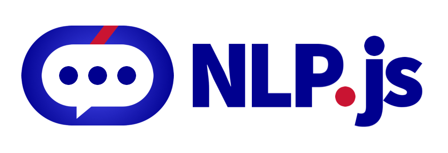

# @nlpjs/core

[](https://travis-ci.com/axa-group/nlp.js)
[](https://coveralls.io/github/axa-group/nlp.js?branch=master)
[](https://www.npmjs.com/package/node-nlp)
[](https://www.npmjs.com/package/node-nlp) [](https://greenkeeper.io/)

## TABLE OF CONTENTS

<!--ts-->

- [Installation](#installation)
- [Container](#container)
  - [Plugins](#plugins)
  - [Pipelines](#pipelines)
  - [Creating a Container](#creating-a-container)
  - [Executing a Pipeline](#executing-a-pipeline)
- [Example of use](#example-of-use)
- [Contributing](#contributing)
- [Contributors](#contributors)
- [Code of Conduct](#code-of-conduct)
- [Who is behind it](#who-is-behind-it)
- [License](#license.md)
  <!--te-->

## Installation

You can install @nlpjs/core-loader:

```bash
    npm install @nlpjs/core-loader
```

## Container

The Container is an IoC container class. Basically it's able to store instances and classes, marked as being singleton or not.
When a class is registered as a singleton, a new instance is created and everytime that the container is asked for this class the same instance is returned. Same behaviour if we register an instance as singleton, but in this case this instance is returned always.
When an instance is registerd as not singleton, the class of the instance is stored and when asked to the container it returns a new instance of this class.

Also in the container can be registered settings with the name of the objects registered, so these settings are provided to the new created instances.

And also pipelines can be registered. Pipelines are sequences of commands that are executed based on the classes and instances known by the container.

### Plugins

At the plugins folder you will find some different classes with atomics tasks:

- *split*: given an object with a property _text_, split this text into an array of characters into the property _splitted_
- *reverse*: given an object with a property _splitted_ that is an array, reverse this array
- *join*: given an object with a property _splitted_ that is an array, join this array into an string into the property _text_
- *lower*: given an object with a property _text_, convert this string to lower case.
- *upperFirst*: given an object with a property _text_, convert the first character to upper case

### Pipelines

If you take a look at the pipelines.md file you'll see this:

```markdown
# Pipelines

## reverse
split
reverse
join
->output.text

## reverse-and-*
$reverse
lower
->output.text

## reverse-and-capitalize
$super
upperFirst
output.text
```

*reverse*, *reverse-and-$ast* and *reverse-and-capitalize* are pipelines. Each one contains commands to be executed in sequence. As you can see, the commands are the name of the plugins, except some exceptions:

- *output.text*: this is telling that at this step take a look at the output object (the one that is returned by the previous step) and from it extract the property text before going to the next step
- *$reverse*: When you start a name with the $ that means not to execute a plugin but to call another pipeline using as input the current output.
- *$super*: This is to call the parent. You can see that *reverse-and-&ast* have an asterisk at the end, this is a wildchar, so will be the parent of those pipelines that match this pattern, in this case *reverse-and-capitalize* match this name so if a child pipeline.
- *->output.text*: when a command starts with the *->* that means that this command should be executed only if this pipeline is the one executed directly, but not when this pipeline is invoked from another pipeline. So when calling *reverse* the output will be an string, but when calling *reverse* from *reverse-and&ast* this last command will be not execute so the output of *reverse* will be the object and not the string.

### Creating a container

This is the way of creating a bootstrapped container:

```javascript
const { containerBootstrap } = require('@nlpjs/core-loader');
const container = containerBootstrap()
```

This automatically will:

- load the .env file if exists as environment variables
- load the conf.json file if exists as configuration (will be explained in other example).
- If the conf.json file does not exists or it does not includes a pipelines path, then load the ./pipelines.md by default as pipelines
- If the conf.json file does not exists or it does not includes a plugin path, then load the content of the folder ./plugins as plugins.

### Executing a pipeline

Containers have a method *runPipeline* where you can pass the name of the pipeline (or the compiled pipeline) and an input to be processed.
Important: this input usually travel through each step of the pipeline, so can be modified by the pipeline execution.
This is an example of code calling the pipeline *reverse-and-capitalize*, that shows how to do inheritance of pipelines, call other pipelines, and have commands that are only executed if the depth of the call is 0 (belongs to the called pipeline).

```javascript
const { containerBootstrap } = require('@nlpjs/core-loader');

async function main() {
  const container = containerBootstrap();
  const input = 'GNIHTEMOS';
  const result = await container.runPipeline('reverse-and-capitalize', input);
  console.log(result); // It should log "Something"
}

main();
```

## Example of Usage

You'll find an example of usage at [examples/01-container](../../examples/01-container/README.md)

## Contributing

You can read the guide of how to contribute at [Contributing](../../CONTRIBUTING.md).

## Contributors

[](https://github.com/axa-group/nlp.js/graphs/contributors)

Made with [contributors-img](https://contributors-img.firebaseapp.com).

## Code of Conduct

You can read the Code of Conduct at [Code of Conduct](../../CODE_OF_CONDUCT.md).

## Who is behind it`?`

This project is developed by AXA Group Operations Spain S.A.

If you need to contact us, you can do it at the email opensource@axa.com

## License

Copyright (c) AXA Group Operations Spain S.A.

Permission is hereby granted, free of charge, to any person obtaining
a copy of this software and associated documentation files (the
"Software"), to deal in the Software without restriction, including
without limitation the rights to use, copy, modify, merge, publish,
distribute, sublicense, and/or sell copies of the Software, and to
permit persons to whom the Software is furnished to do so, subject to
the following conditions:

The above copyright notice and this permission notice shall be
included in all copies or substantial portions of the Software.

THE SOFTWARE IS PROVIDED "AS IS", WITHOUT WARRANTY OF ANY KIND,
EXPRESS OR IMPLIED, INCLUDING BUT NOT LIMITED TO THE WARRANTIES OF
MERCHANTABILITY, FITNESS FOR A PARTICULAR PURPOSE AND
NONINFRINGEMENT. IN NO EVENT SHALL THE AUTHORS OR COPYRIGHT HOLDERS BE
LIABLE FOR ANY CLAIM, DAMAGES OR OTHER LIABILITY, WHETHER IN AN ACTION
OF CONTRACT, TORT OR OTHERWISE, ARISING FROM, OUT OF OR IN CONNECTION
WITH THE SOFTWARE OR THE USE OR OTHER DEALINGS IN THE SOFTWARE.
