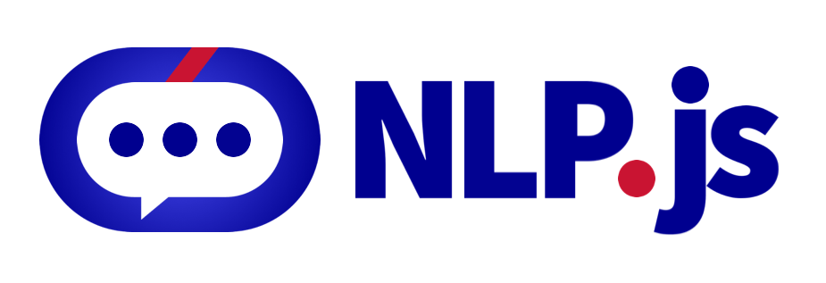

# @nlpjs/lang-es

[](https://travis-ci.com/axa-group/nlp.js)
[](https://coveralls.io/github/axa-group/nlp.js?branch=master)
[](https://www.npmjs.com/package/node-nlp)
[](https://www.npmjs.com/package/node-nlp) [](https://greenkeeper.io/)

## TABLE OF CONTENTS

<!--ts-->

- [Installation](#installation)
- [Normalization](#normalization)
- [Tokenization](#tokenization)
- [Identify if a word is a spanish stopword](#identify-if-a-word-is-a-spanish-stopword)
- [Remove stopwords from an array of words](#remove-stopwords-from-an-array-of-words)
- [Change the stopwords dictionary](#change-the-stopwords-dictionary)
- [Stemming word by word](#stemming-word-by-word)
- [Stemming an array of words](#stemming-an-array-of-words)
- [Normalizing, Tokenizing and Stemming a sentence](#normalizing-tokenizing-and-stemming-a-sentence)
- [Remove stopwords when stemming a sentence](#remove-stopwords-when-stemming-a-sentence)
- [Sentiment Analysis](#sentiment-analysis)
- [Example of usage on a classifier](#example-of-usage-on-a-classifier)
- [Contributing](#contributing)
- [Contributors](#contributors)
- [Code of Conduct](#code-of-conduct)
- [Who is behind it](#who-is-behind-it)
- [License](#license.md)
  <!--te-->

## Installation

You can install @nlpjs/lang-es:

```bash
    npm install @nlpjs/lang-es
```

## Normalization

Normalization of a text converts it to lowercase and remove decorations of characters.

```javascript
const { NormalizerEs } = require('@nlpjs/lang-es');

const normalizer = new NormalizerEs();
const input = 'Esto debería ser normalizado';
const result = normalizer.normalize(input);
console.log(result);
// output: esto deberia ser normalizado
```

## Tokenization

Tokenization splits a sentence into words.

```javascript
const { TokenizerEs } = require('@nlpjs/lang-es');

const tokenizer = new TokenizerEs();
const input = "Esto debería ser tokenizado";
const result = tokenizer.tokenize(input);
console.log(result);
// output: [ 'Esto', 'debería', 'ser', 'tokenizado' ]
```

Tokenizer can also normalize the sentence before tokenizing, to do that provide a _true_ as second argument to the method _tokenize_

```javascript
const { TokenizerEs } = require('@nlpjs/lang-es');

const tokenizer = new TokenizerEs();
const input = "Esto debería ser tokenizado";
const result = tokenizer.tokenize(input, true);
console.log(result);
// output: [ 'esto', 'deberia', 'ser', 'tokenizado' ]
```

## Identify if a word is a spanish stopword

Using the class _StopwordsEs_ you can identify if a word is an stopword:

```javascript
const { StopwordsEs } = require('@nlpjs/lang-es');

const stopwords = new StopwordsEs();
console.log(stopwords.isStopword('un'));
// output: true
console.log(stopwords.isStopword('desarrollador'));
// output: false
```

## Remove stopwords from an array of words

Using the class _StopwordsEs_ you can remove stopwords form an array of words:

```javascript
const { StopwordsEs } = require('@nlpjs/lang-es');

const stopwords = new StopwordsEs();
console.log(stopwords.removeStopwords(['he', 'visto', 'a', 'un', 'programador']));
// output: ['he', 'visto', 'programador']
```

## Change the stopwords dictionary
Using the class _StopwordsEs_ you can restart it dictionary and build it from another set of words:

```javascript
const { StopwordsEs } = require('@nlpjs/lang-es');

const stopwords = new StopwordsEs();
stopwords.dictionary = {};
stopwords.build(['he', 'visto']);
console.log(stopwords.removeStopwords(['he', 'visto', 'a', 'un', 'programador']));
// output: ['a', 'un', 'programador']
```

## Stemming word by word

An stemmer is an algorithm to calculate the _stem_ (root) of a word, removing affixes. 

You can stem one word using method _stemWord_:

```javascript
const { StemmerEs } = require('@nlpjs/lang-es');

const stemmer = new StemmerEs();
const input = 'programador';
console.log(stemmer.stemWord(input));
// output: program
```

## Stemming an array of words

You can stem an array of words using method _stem_:

```javascript
const { StemmerEs } = require('@nlpjs/lang-es');

const stemmer = new StemmerEs();
const input = ['he', 'visto', 'a', 'un', 'programador'];
console.log(stemmer.stem(input));
// outuput: [ 'hab', 'vist', 'a', 'un', 'program' ]
```

## Normalizing, Tokenizing and Stemming a sentence

As you can see, stemmer does not do internal normalization, so words with uppercases will remain uppercased. 
Also, stemmer works with lowercased affixes, so _programador_ will be stemmed as _program_ but _PROGRAMADOR_ will not be changed.

You can tokenize and stem a sentence, including normalization, with the method _tokenizeAndStem_:

```javascript
const { StemmerEs } = require('@nlpjs/lang-es');

const stemmer = new StemmerEs();
const input = 'He visto a un PROGRAMADOR';
console.log(stemmer.tokenizeAndStem(input));
// output: [ 'hab', 'vist', 'a', 'un', 'program' ]
```

## Remove stopwords when stemming a sentence

When calling _tokenizeAndStem_ method from the class _StemmerES_, the second parameter is a boolean to set if the stemmer must keep the stopwords (true) or remove them (false). Before using it, the stopwords instance must be set into the stemmer:

```javascript
const { StemmerEs, StopwordsEs } = require('@nlpjs/lang-es');

const stemmer = new StemmerEs();
stemmer.stopwords = new StopwordsEs();
const input = 'he visto a un programador';
console.log(stemmer.tokenizeAndStem(input, false));
// output: ['hab', 'vist', 'program']
```

## Sentiment Analysis

To use sentiment analysis you'll need to create a new _Container_ and use the plugin _LangES_, because internally the _SentimentAnalyzer_ class try to retrieve the normalizer, tokenizer, stemmmer and sentiment dictionaries from the container.

```javascript
const { Container } = require('@nlpjs/core');
const { SentimentAnalyzer } = require('@nlpjs/sentiment');
const { LangEs } = require('@nlpjs/lang-es');

(async () => {
  const container = new Container();
  container.use(LangEs);
  const sentiment = new SentimentAnalyzer({ container });
  const result = await sentiment.process({ locale: 'es', text: 'me gustan los gatos' });
  console.log(result.sentiment);
})();
// output:
// {
//   score: 0.266,
//   numWords: 4,
//   numHits: 1,
//   average: 0.0665,
//   type: 'senticon',
//   locale: 'es',
//   vote: 'positive'
// }
```

The output of the sentiment analysis includes:
- *score*: final score of the sentence. 
- *numWords*: total words of the sentence.
- *numHits*: total words of the sentence identified as having a sentiment score.
- *average*: score divided by numWords
- *type*: type of dictionary used, values can be afinn, senticon or pattern.
- *locale*: locale of the sentence
- *vote*: positive if score greater than 0, negative if score lower than 0, neutral if score equals 0.

## Example of usage on a classifier

```javascript
const { containerBootstrap } = require('@nlpjs/core');
const { Nlp } = require('@nlpjs/nlp');
const { LangEs } = require('@nlpjs/lang-es');

(async () => {
  const container = await containerBootstrap();
  container.use(Nlp);
  container.use(LangEs);
  const nlp = container.get('nlp');
  nlp.settings.autoSave = false;
  nlp.addLanguage('es');
  // Adds the utterances and intents for the NLP
  nlp.addDocument('es', 'adios por ahora', 'greetings.bye');
  nlp.addDocument('es', 'adios y ten cuidado', 'greetings.bye');
  nlp.addDocument('es', 'muy bien nos vemos luego', 'greetings.bye');
  nlp.addDocument('es', 'debo irme', 'greetings.bye');
  nlp.addDocument('es', 'hola', 'greetings.hello');
  
  // Train also the NLG
  nlp.addAnswer('es', 'greetings.bye', 'hasta la proxima');
  nlp.addAnswer('es', 'greetings.bye', '¡te veo pronto!');
  nlp.addAnswer('es', 'greetings.hello', '¡hola que tal!');
  nlp.addAnswer('es', 'greetings.hello', '¡salludos!');
  await nlp.train();
  const response = await nlp.process('es', 'debo irme');
  console.log(response);
})();
```

## Contributing

You can read the guide of how to contribute at [Contributing](../../CONTRIBUTING.md).

## Contributors

[](https://github.com/axa-group/nlp.js/graphs/contributors)

Made with [contributors-img](https://contributors-img.firebaseapp.com).

## Code of Conduct

You can read the Code of Conduct at [Code of Conduct](../../CODE_OF_CONDUCT.md).

## Who is behind it`?`

This project is developed by AXA Group Operations Spain S.A.

If you need to contact us, you can do it at the email opensource@axa.com

## License

Copyright (c) AXA Group Operations Spain S.A.

Permission is hereby granted, free of charge, to any person obtaining
a copy of this software and associated documentation files (the
"Software"), to deal in the Software without restriction, including
without limitation the rights to use, copy, modify, merge, publish,
distribute, sublicense, and/or sell copies of the Software, and to
permit persons to whom the Software is furnished to do so, subject to
the following conditions:

The above copyright notice and this permission notice shall be
included in all copies or substantial portions of the Software.

THE SOFTWARE IS PROVIDED "AS IS", WITHOUT WARRANTY OF ANY KIND,
EXPRESS OR IMPLIED, INCLUDING BUT NOT LIMITED TO THE WARRANTIES OF
MERCHANTABILITY, FITNESS FOR A PARTICULAR PURPOSE AND
NONINFRINGEMENT. IN NO EVENT SHALL THE AUTHORS OR COPYRIGHT HOLDERS BE
LIABLE FOR ANY CLAIM, DAMAGES OR OTHER LIABILITY, WHETHER IN AN ACTION
OF CONTRACT, TORT OR OTHERWISE, ARISING FROM, OUT OF OR IN CONNECTION
WITH THE SOFTWARE OR THE USE OR OTHER DEALINGS IN THE SOFTWARE.
